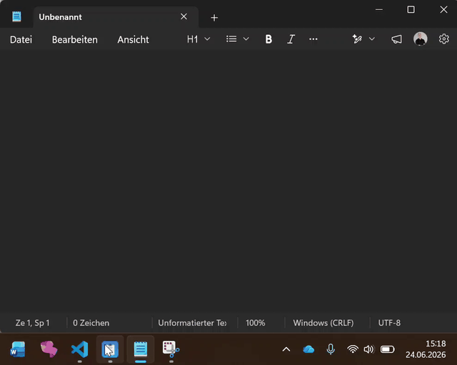

# Paste Stuff


A tiny Windows background app that pastes configured text snippets into **any**
application — either via a global keyboard shortcut or from a right-click menu on
its taskbar icon (a Windows Jump List, just like the Microsoft 365 app).

There is **no window UI**. The app lives only as a taskbar icon.


---

## Demo



> The animation above loops automatically. For a full-quality version, [download/open `demo.mp4`](docs/demo.mp4) directly.

---

## Features

- **Global keyboard shortcuts** — press e.g. `Ctrl+Shift+1` in any app to paste a
  snippet.
- **Taskbar menu (Jump List)** — right-click the taskbar icon to pick a snippet,
  or to access app actions (Edit config / Reload config / Run at startup / Quit).
- **JSON configuration** — define your shortcuts and snippet text in
  `config.json`. No code changes needed.
- **Smart pasting** — pastes directly into classic Windows edit fields
  (`WM_PASTE`, no keystroke); everything else (browsers, Electron, Office, UWP)
  gets a reliable focus restore + `Ctrl+V`.
- **Run at startup** — optional auto-start with Windows.
- **Console logging** — every action is logged when started from a console.
- **Single instance** — a second launch detects the running app and exits.

---

## Requirements

- Windows 10/11
- Python 3.x (the project was set up with Python 3.14 via the `py` launcher)

Python dependencies (installed into the local `.venv`):

```
keyboard
pyperclip
pywin32
```

---

## Setup

From the project folder (`paste stuff`):

```powershell
# 1. Create the virtual environment
py -3 -m venv .venv

# 2. Install dependencies
.\.venv\Scripts\python.exe -m pip install -r requirements.txt
```

---

## Running the app

### In the background (recommended)

Double-click **`run.bat`**, or run:

```powershell
.\.venv\Scripts\pythonw.exe main.py
```

`pythonw.exe` runs without a console window. The app appears as an icon in the
taskbar.

### With a console (to see logs)

```powershell
.\.venv\Scripts\python.exe main.py
```

Every action (startup, registered hotkeys, pastes, reloads, quit) is printed to
this console. In background mode there is no console, so logs are simply not
shown.

### Quitting

Right-click the taskbar icon → **Quit Paste Stuff** (or close the window via the
taskbar). This unregisters the global hotkeys and exits.

---

## Configuration

Edit **`config.json`**. Each entry maps a hotkey to the text that should be
pasted:

```json
{
  "shortcuts": {
    "ctrl+shift+1": "Hello from my paste tool!",
    "ctrl+shift+2": "Best regards,\nMax",
    "ctrl+shift+3": "my.email@example.com"
  }
}
```

- **Keys** are hotkey combinations using the
  [`keyboard`](https://github.com/boppreh/keyboard) library syntax, e.g.
  `ctrl+shift+1`, `ctrl+alt+e`, `ctrl+shift+f12`.
- **Values** are the text to paste. Use `\n` for line breaks; Unicode and emoji
  are supported.

After editing, choose **Reload config** from the taskbar menu (no restart
needed). You can also open the file via **Edit config** in the same menu.

---

## How it works

```
┌─────────────────────────────┐        ┌──────────────────────────────┐
│  Global keyboard shortcut   │        │  Taskbar icon (Jump List)    │
│  (Ctrl+Shift+1, ...)        │        │  right-click → menu          │
└──────────────┬──────────────┘        └───────────────┬──────────────┘
               │ keyboard lib                            │ launches helper
               │ triggers in-process                     │ process
               ▼                                         ▼
        paste into the                          main.py --action paste --key K
        already-focused app                              │
        (Ctrl+V)                                          │ localhost socket
                                                          ▼
                                            Running app receives the command,
                                            restores focus to the previously
                                            active window, and pastes there.
```

- **Resident process** (`main.py` with no arguments): registers the global
  hotkeys, draws the taskbar icon, builds the Jump List, tracks which window you
  were last working in, and listens on a local loopback socket
  (`127.0.0.1:50573`).
- **Taskbar Jump List entries** are static Windows shortcuts that re-launch
  `main.py` with an `--action`. That short-lived helper process forwards the
  command to the running app over the socket, then exits. This is why the menu
  items can talk to the already-running app.
- **Pasting from the menu**: because the app is in the foreground while the menu
  is open, it first hands focus back to the window you were last using, then
  inserts the text (direct `WM_PASTE` for classic edit controls, otherwise
  `Ctrl+V`).

### Command-line actions

These are normally invoked by the Jump List, but you can run them manually too:

| Command                                   | Effect                          |
| ----------------------------------------- | ------------------------------- |
| `main.py`                                 | Start the resident app          |
| `main.py --action paste --key "ctrl+shift+1"` | Paste that snippet          |
| `main.py --action reload`                 | Reload `config.json`            |
| `main.py --action autostart`              | Toggle run-at-startup           |
| `main.py --action edit`                   | Open `config.json`              |
| `main.py --action quit`                   | Quit the running app            |

---

## Run at startup

Toggle **Run at startup** in the taskbar menu. It adds/removes a `Paste Stuff`
value under:

```
HKEY_CURRENT_USER\Software\Microsoft\Windows\CurrentVersion\Run
```

pointing at `pythonw.exe main.py`, so the app starts automatically (without a
console) when you log in.

---

## Files

| File               | Purpose                                            |
| ------------------ | -------------------------------------------------- |
| `main.py`          | The application                                    |
| `config.json`      | Your shortcuts and snippet text                    |
| `requirements.txt` | Python dependencies                                |
| `run.bat`          | Starts the app in the background (no console)      |
| `icon.ico`         | Taskbar/menu icon                                  |
| `docs/`            | README media (icon image, demo GIF and video)      |
| `.venv/`           | Local virtual environment                          |

---

## Troubleshooting

- **A shortcut does nothing in some apps** — apps running as administrator only
  receive global keystrokes if Paste Stuff also runs as administrator.
- **The taskbar menu pastes into the wrong place** — the app pastes into the last
  window you used before opening the menu. Click into your target app first, then
  open the menu.
- **Hotkey not registered** — check the console log for `Invalid hotkey`; verify
  the combination spelling in `config.json`.
- **App won't start / "already running"** — another instance owns the socket
  port. Quit it from the taskbar, or end the `python`/`pythonw` process.
